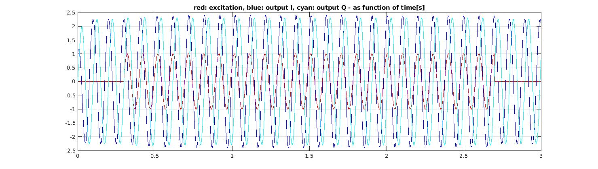

# An Adaptive Frequency Oscillator example with the Arduino

The *adaptiveFreqOsc* project for Arduino is a fascinating example of a self learning algorithm.
Ijspeert[1] presented a Hopf frequency oscillator and added an extra state variable to it, that forces the oscillator to follow any periodic input signal. In other words, this type of oscillator can adapt its parameters to learn the frequency of any periodic input signal. The Arduino sketch presented here, is an example of a practical implementation of such oscillator.
The model from Ijspeert was discretized first, to make it run on the Arduino at a sampling frequency of 1kHz. The implications of the discretization are, that the oscillator will no longer synchronize to *any* periodic input signal. The sampling frequency must be taken into account.

The larger the frequency difference between the current output and the input of the oscillator, the longer it will take for the oscillator to converge to the desired input frequency. First, try the oscillator learning with only a few Hz difference between output and input and play with the parameter values for Epsilon, gamma and mu. After converging, take the input signal away and the last offered input frequency will stay encoded in the system.

The included Matlab script file *adaptive_Hopf.m* was used for the development of the C-code for the Arduino. The script can be used to tune the oscillator parameters first. Figs. 1 and 2 are the result of a simulation with: Epsilon=15.0, gamma=100.0 and mu=1.0.
f0=10.0Hz and finput=12.5Hz.

In Fig. 1 the input stimulus appears at t=2.5s. The output slowly converges to 12.5Hz. At t=7.5s, the input is turned off again.

Turning off the input at t=7.5s, is happening just before the moment that the oscillator is converged to 12.5Hz. The last frequency stays encoded in the oscillator.

References:
[1] A.J.Ijspeert, Adaptive Frequency Oscillators, [https://biorob.epfl.ch/cms/page-36365.html](https://biorob.epfl.ch/cms/page-36365.html) 
