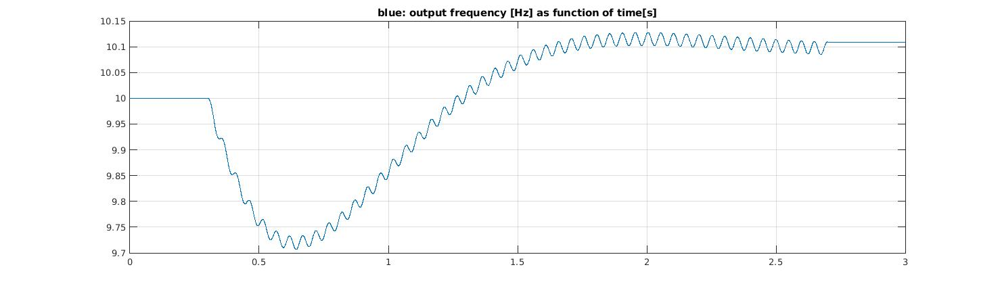

# An Adaptive Hopf Frequency Oscillator demo with Arduino

The *adaptiveFreqOsc* project for Arduino is a fascinating example of a self learning algorithm.
Ijspeert[1] presented a Hopf frequency oscillator and added an extra state variable to it, that forces the oscillator to follow any periodic input signal. In other words, this type of oscillator can adapt its parameters to learn the frequency of the periodic input signal. The Arduino sketch presented here, is an example of a practical implementation of such oscillator.
First, the model from Ijspeert was discretized to make it run on the Arduino. The implications of the discretization are, that the oscillator will no longer synchronize to *any* periodic input signal. The sampling frequency must be taken into account.

The larger the frequency difference between the current output and the input of the oscillator, the longer it will take for the oscillator to converge to the desired input frequency. First, try the oscillator learning only with  a few tenth of Hz's difference between output and input and play with the parameter values for Eps(ilon), gamma and mu. After converging, take away the input signal and the last applied input frequency will stay encoded in the system.

The included Matlab script file *adaptive_Hopf.m* was used for the development of the C-code for the Arduino. The script can be used to tune the oscillator parameters before implementation of the oscillator in the Arduino. Figs. 1 and 2 are the result of a simulation at a loop-rate of 3kHz and with Eps=20.0, gamma=10.0 and mu=5.0,  f_initial=10.0Hz and f_excitation=10.1Hz.

In Fig. 1 the input stimulus appears at t=0.3s. The output slowly converges towards 10.1Hz. At t=2.7s the input is turned off again. Output I is the in-phase output and output Q the quadrature output. Fig. 2 shows the output frequency as function of time.

## Application Examples

Arduino sketch *adaptiveFreqOsc1* runs at 1kHz. The intrinsic frequency is set to 1Hz.

Arduino sketch *adaptiveFreqOsc2* runs at 3kHz. The intrinsic frequency is set to 10Hz.

A higher loop rate on a faster processor makes higher output frequencies and a faster locking response possible. The higher the sample frequency is relative to the output frequency, the higher the frequency capture range will be.

## References

[1] A.J.Ijspeert, Adaptive Frequency Oscillators, [https://www.epfl.ch/labs/biorob/research/neuromechanical/page-36365-en-html](https://www.epfl.ch/labs/biorob/research/neuromechanical/page-36365-en-html) 
